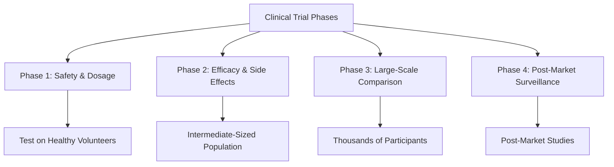

# Module 2: Common Types of Clinical Trials

## Overview
Clinical trials are categorized based on their purpose, methodology, and phases. Each trial serves a distinct role in evaluating interventions and improving health outcomes.

## Learning Objectives
By the end of this module, you should be able to:
- Identify the phases of clinical trials and their purposes.
- Understand the difference between interventional and observational studies.
- Describe the unique characteristics of special trial types like adaptive or pragmatic trials.

---

## Key Details

### 1. Types of Clinical Trials
- **Interventional Trials**: Assess the effects of a specific intervention, such as a drug, device, or procedure, on human health.
- **Observational Trials**: Investigate outcomes without assigning specific interventions (e.g., cohort or case-control studies).
- **Pragmatic Trials**: Focus on effectiveness in real-world settings.
- **Adaptive Trials**: Utilize interim data to modify trial aspects dynamically.
- **Preventive Trials**: Study measures to prevent diseases.
- **Diagnostic Trials**: Evaluate the efficacy of diagnostic tests.
- **Quality-of-Life Trials**: Focus on improving life quality for patients with chronic diseases.

---

### 2. Clinical Trial Phases
Clinical trials typically progress through **four phases**, each building on data from the previous phase:
1. **Phase 1**: Safety and dosage testing with a small group of volunteers.
2. **Phase 2**: Efficacy and side effects on a larger group.
3. **Phase 3**: Confirmation of efficacy, monitoring of adverse effects, and comparison to existing treatments.
4. **Phase 4**: Post-market surveillance to gather additional safety and effectiveness data.

---

### 3. Ethical and Regulatory Considerations
- Clinical trials must adhere to **Good Clinical Practice (GCP)** and comply with regulatory standards like those of the **FDA** and **ICH**.
- **Informed Consent**: Ensures participants understand trial procedures, risks, and rights.
- **Institutional Review Boards (IRBs)**: Approve and oversee trial conduct to ensure ethical compliance.

---

## Mermaid Chart for Clinical Trial Phases

---

## Challenges in Trial Design
- **Recruitment and Retention**: Engaging diverse participants.
- **Cost Management**: Controlling high operational costs.
- **Regulatory Burden**: Adhering to multiple compliance standards.

---

## Summary
Clinical trials play a pivotal role in advancing medical science. They assess interventions, monitor safety, and contribute to better healthcare outcomes. Addressing challenges like participant recruitment, cost, and regulatory compliance is crucial for successful trial execution.
