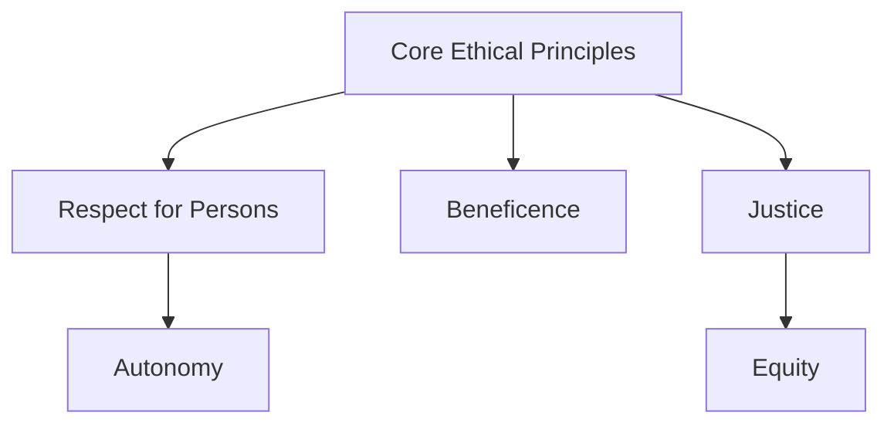
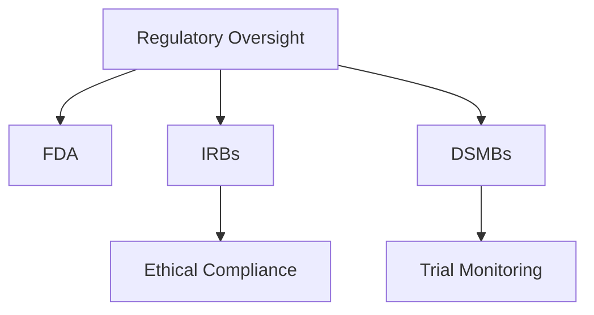

# Module 3: Ethical Framework and Regulatory Oversight in Clinical Research

## Content Author
**Quincy Byrdsong, EdD, CIP, CCRP**  
Lipscomb University  

---

## Introduction

Clinical research operates within a robust ethical and regulatory framework designed to protect human participants while ensuring the validity and reliability of research outcomes. This module explores the ethical principles guiding clinical research, regulatory bodies responsible for oversight, and the frameworks in place to maintain the integrity of clinical studies. A strong understanding of this framework is vital for any professional engaged in clinical research.

---

## Learning Objectives

By the end of this module, you should be able to:
- Explain the core ethical principles underpinning clinical research.
- Identify the key regulatory agencies involved in clinical research oversight.
- Describe the significance of ethical guidelines such as the Belmont Report and Declaration of Helsinki.
- Discuss the role of Institutional Review Boards (IRBs) and Data and Safety Monitoring Boards (DSMBs).

---

## Core Ethical Principles

### 1. **Respect for Persons**
- Individuals must be treated as autonomous agents capable of making informed decisions.
- Special protection is given to those with diminished autonomy (e.g., children, mentally impaired individuals).

### 2. **Beneficence**
- Researchers have an obligation to maximize potential benefits and minimize possible harms to participants.

### 3. **Justice**
- Equitable distribution of the benefits and burdens of research.
- Avoidance of exploitation of vulnerable populations.

These principles were formalized in **The Belmont Report** (1979) and continue to guide modern clinical research.

---

## Key Ethical Guidelines

### 1. **Declaration of Helsinki**
Adopted by the World Medical Association, it outlines the ethical considerations for medical research involving humans, emphasizing informed consent and scientific integrity.

### 2. **Good Clinical Practice (GCP)**
GCP provides an international standard for designing, conducting, recording, and reporting clinical trials.

---

## Regulatory Oversight

### 1. **U.S. Food and Drug Administration (FDA)**
- Ensures the safety and efficacy of investigational drugs and devices.
- Regulates clinical trial protocols and outcomes.

### 2. **Institutional Review Boards (IRBs)**
- IRBs are responsible for the initial and ongoing review of clinical trials.
- They ensure compliance with ethical and regulatory standards.

### 3. **Data and Safety Monitoring Boards (DSMBs)**
- Independently monitor trial safety and data integrity.
- Can recommend modifications or termination of a trial if safety concerns arise.

---

## Informed Consent

Informed consent is a foundational element of ethical clinical research. It involves:  
1. Providing participants with all necessary information about the study.
2. Ensuring participants understand the risks and benefits.
3. Documenting the voluntary agreement to participate.

---

## Role of Ethics Committees

Ethics committees, such as IRBs, play a crucial role in upholding ethical standards by:
- Reviewing research protocols.
- Ensuring adequate protection for vulnerable populations.
- Monitoring the consent process and study conduct.

---

## Challenges in Ethical Oversight

- Balancing rapid scientific advancements with ethical considerations.
- Addressing disparities in access to clinical trials.
- Maintaining transparency in global, multicenter trials.

---

## Conclusion

Ethical and regulatory oversight is the cornerstone of trustworthy clinical research. By adhering to core ethical principles, guidelines, and regulatory requirements, researchers ensure the safety and dignity of participants while advancing scientific knowledge.

---

