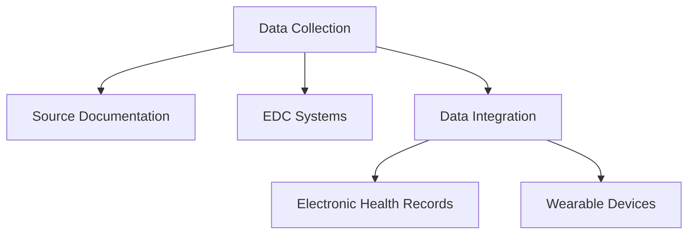
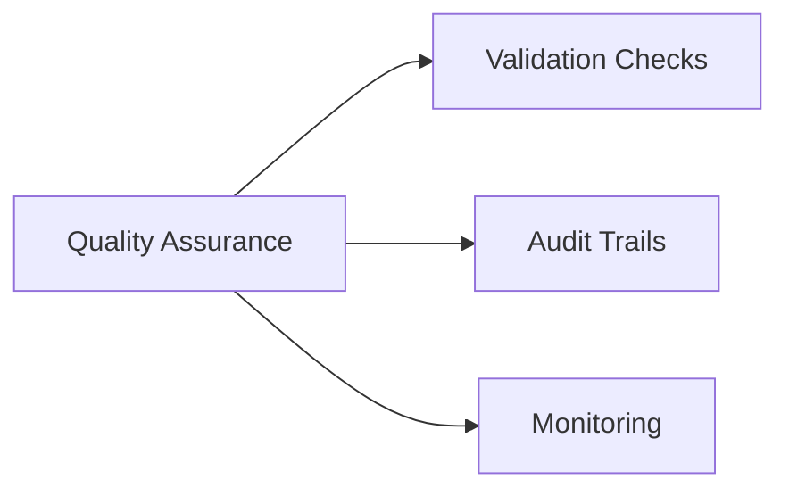
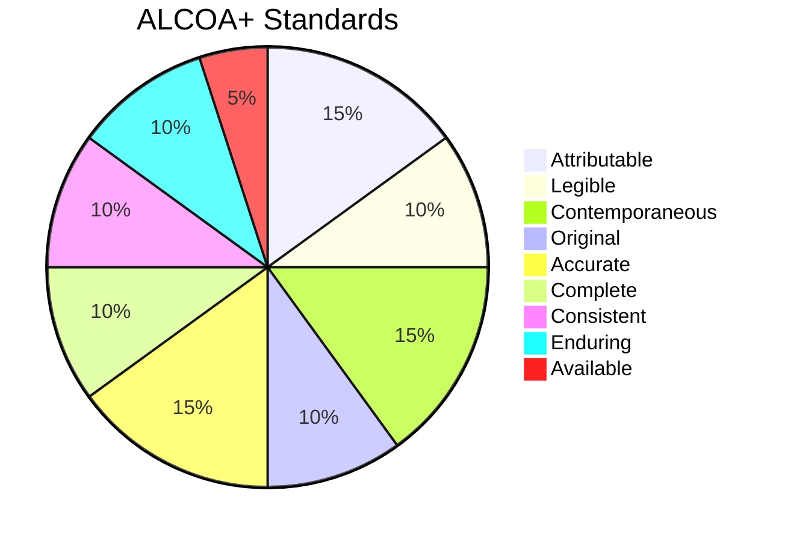
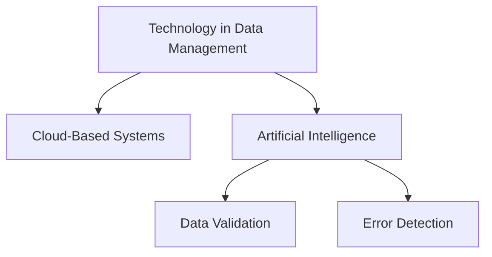

# Module 4: Data Management and Quality in Clinical Research

## Introduction
Data management and quality are crucial components of clinical research, ensuring that the outcomes are reliable, valid, and adhere to ethical and regulatory standards. Proper data collection, processing, and validation minimize errors and maximize the credibility of research findings.

This module provides a detailed overview of data management practices, quality assurance processes, and strategies to maintain data integrity in clinical research.

---

## Key Topics Covered

1. **Data Collection Processes**
   - Source documentation and data entry.
   - Electronic data capture systems (EDC).
   - Integration of data from multiple sources.

2. **Data Quality Assurance**
   - Implementing quality control measures.
   - Conducting regular audits and reviews.

3. **Data Integrity Principles**
   - ALCOA+ standards (Attributable, Legible, Contemporaneous, Original, Accurate, Complete, Consistent, Enduring, Available).

4. **Data Security and Privacy**
   - HIPAA compliance.
   - Data encryption and secure storage.

5. **Role of Technology in Data Management**
   - Cloud-based data systems.
   - Artificial intelligence in data validation and monitoring.

---

## Data Collection Processes

### Key Steps in Data Collection:
1. **Source Data Documentation**
   - Ensures accurate, contemporaneous records.
   - Includes patient records, diagnostic results, and investigator notes.

2. **Electronic Data Capture (EDC) Systems**
   - Tools for digitizing and managing clinical trial data.
   - Benefits: Reduced errors, real-time data entry, and streamlined monitoring.

3. **Data Integration**
   - Combines datasets from multiple sources (e.g., EHRs, wearable devices).
   - Challenges: Ensuring data compatibility and accuracy.

---

## Data Quality Assurance

### Quality Control Measures:
1. **Validation Checks**
   - Ensure data consistency and accuracy.
   - Example: Cross-checking entered data with source documents.

2. **Audit Trails**
   - Maintain a log of data changes.
   - Enhance traceability and accountability.

3. **Regular Monitoring**
   - Continuous assessment of data accuracy.
   - On-site and remote monitoring.

---

## Data Integrity Principles

### ALCOA+ Standards:
- **Attributable**: Data should be traceable to the origin.
- **Legible**: Data must be clear and readable.
- **Contemporaneous**: Data should be recorded at the time of occurrence.
- **Original**: Retain the first recorded observation.
- **Accurate**: Data must be correct and consistent.
- **Complete**: No data should be missing.
- **Consistent**: Data must follow a logical format.
- **Enduring**: Data should be durable and retrievable.
- **Available**: Data must be accessible for audits and reviews.

---

## Data Security and Privacy

### HIPAA Compliance:
- Protects personal health information (PHI).
- Ensures secure data transmission and storage.

### Key Practices:
1. **Data Encryption**
   - Secures data in transit and at rest.
2. **Access Control**
   - Restricts data access to authorized personnel.
3. **Regular Security Audits**
   - Identifies and mitigates potential vulnerabilities.

---

## Role of Technology in Data Management

### Cloud-Based Systems:
- Enable real-time data sharing and collaboration.
- Benefits: Scalability, cost-efficiency, and global access.

### Artificial Intelligence (AI):
- Automates data validation and monitoring.
- Detects anomalies and flags potential errors.

---

## Summary

Effective data management ensures the reliability and credibility of clinical research outcomes. By adhering to best practices in data collection, quality assurance, and security, researchers can maintain the highest standards of data integrity. Leveraging technology further enhances the efficiency and accuracy of clinical data processes, paving the way for meaningful scientific advancements.
