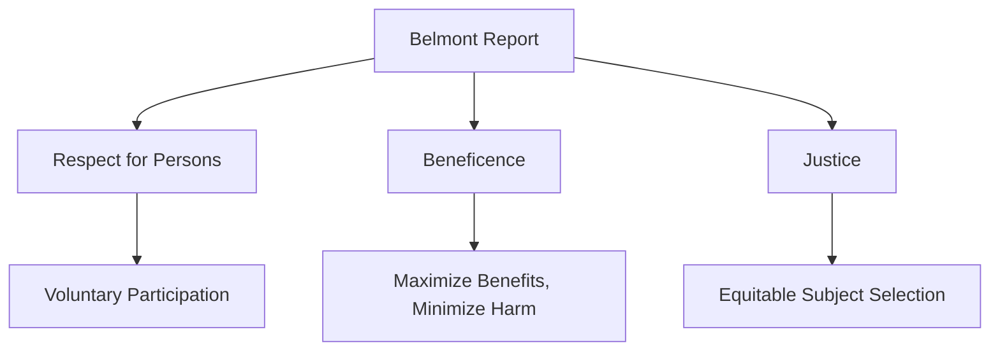
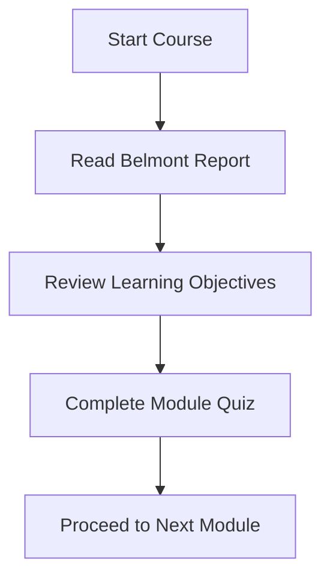

# Module: The CITI Good Clinical Practice Course for Clinical Trials Involving Drugs and Biologics (ID 14613)

## **Introduction**

This module introduces the ethical principles foundational to clinical trial regulations. It provides an overview of the Belmont Report and its application in clinical research.

---

## **Learning Objectives**

By the end of this module, you will be able to:

- Identify the three principles from the Belmont Report.
- Discuss the application of Belmont principles to clinical research.
- Evaluate federal regulations for clinical research and drug development.
- Determine the role of the International Council for Harmonisation (ICH).
- Recognize the role of international standards in clinical research.
- Identify clinical researcher responsibilities.

---

## **Course Content Overview**

This course is designed for clinical trials involving drugs and biologics. The term "drug" includes both drugs and biologics. The modules are interdependent, with some content repeated for emphasis.

### **Modules Included**

1. **Overview of New Drug Development**
2. **Overview of ICH GCP**
3. **ICH - Comparison Between ICH GCP E6 and U.S. FDA Regulations**
4. **Conducting Investigator-Initiated Studies According to FDA Regulations and GCP**
5. **Investigator Obligations in FDA-Regulated Research**
6. **Managing Investigational Agents According to GCP Requirements**
7. **Informed Consent in Clinical Trials of Drugs and Biologics**
8. **Monitoring Clinical Trials of Drugs by Industry Sponsors**
9. **Audits and Inspections of Clinical Trials of Drugs and Biologics**
10. **Detecting and Evaluating Adverse Events**
11. **Reporting Serious Adverse Events in Investigations of Drugs and Biologics**

---

## **GCP Mutual Recognition**

Completion of this course after 20 January 2017 satisfies the Minimum Criteria for ICH GCP Investigator Site Personnel Training, enabling mutual recognition of GCP training among trial sponsors under TransCelerate BioPharma.

### **Documentation for Mutual Recognition**

Submit either:

- **Completion Certificate**
- **Completion Report**

Ensure it includes the course name and version number as attested to TransCelerate.

---

## **The Belmont Report**

The Belmont Report, released in 1979, provides the ethical framework for Federal Regulations to protect human research subjects. It emphasizes:

- **Respect for Persons**
- **Beneficence**
- **Justice**

---

## **Target Audience**

The course is intended for:

- Clinical researchers participating in human subjects research.
- Individuals needing understanding of:
  - Federal regulations
  - ICH guidelines, including ICH E6(R2)
  - Good Clinical Practice standards

---

## **Learning Resources**

- The Belmont Report is required reading for all participants.
- Terminology Note: The term **Institutional Review Board (IRB)** includes Research Ethics Board (REB) and Independent Ethics Committee (IEC).

---

## **Estimated Time to Complete**

- **4 Hours** to complete all modules.
- Modules may vary in duration depending on your background and familiarity.

---

## **Next Steps**

1. Review the Belmont Report.
2. Take the module quiz, which focuses on the Belmont Report.

